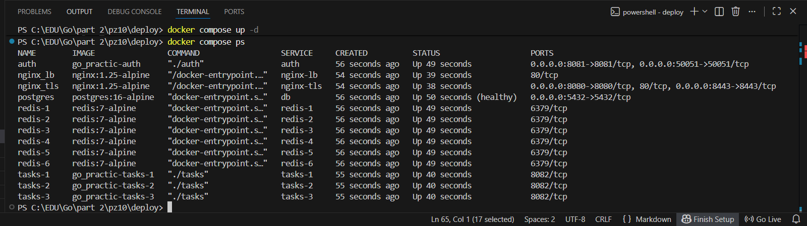
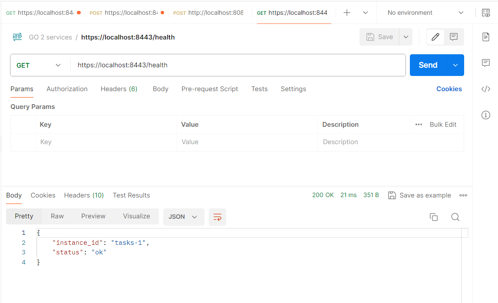
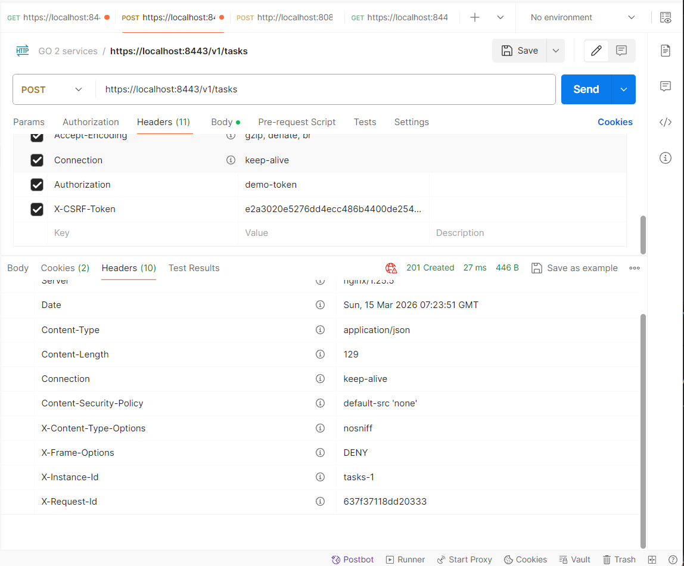
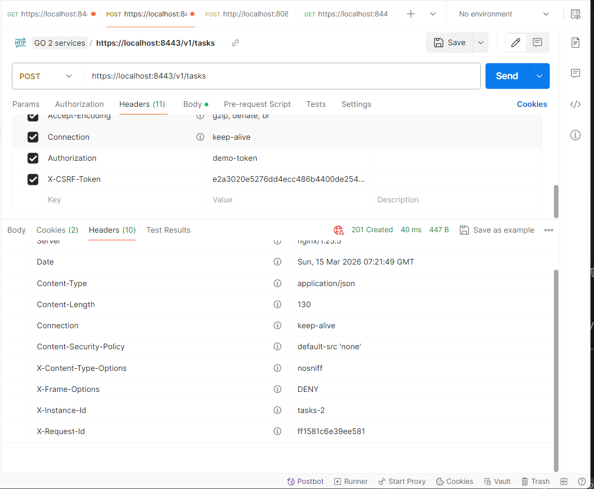
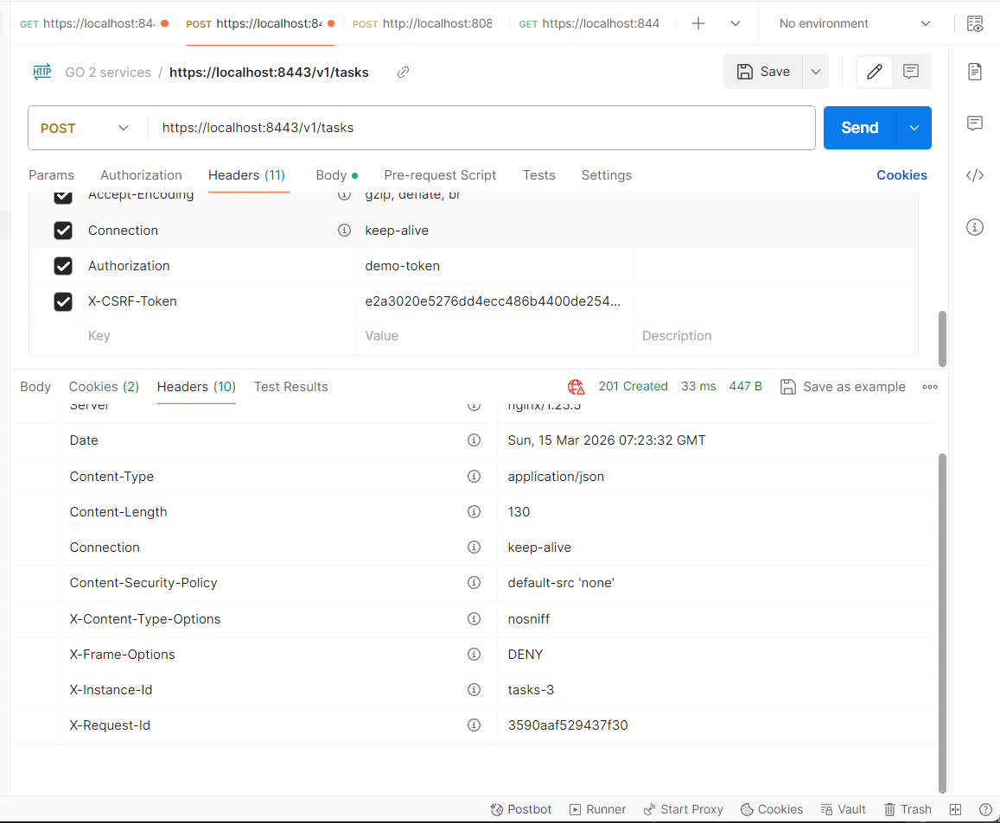
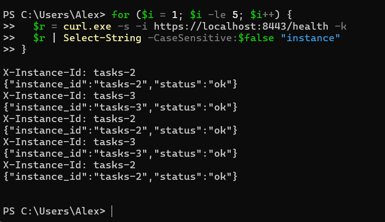

# Практическое занятие №10

## Горизонтальное масштабирование: Load Balancer (NGINX)

**Студент:** Холодков А.Д.  
**Группа:** ЭФМО-01-25

## Конфигурация реплик

Каждая реплика отличается только переменной `INSTANCE_ID`. Порты наружу не пробрасываются — трафик идёт только через nginx-lb.

| Реплика | Контейнер | INSTANCE_ID | Порт (внутри сети) |
|---------|-----------|-------------|-------------------|
| 1 | tasks-1 | tasks-1 | 8082 |
| 2 | tasks-2 | tasks-2 | 8082 |
| 3 | tasks-3 | tasks-3 | 8082 |

`INSTANCE_ID` добавляется заголовком `X-Instance-ID` в каждый ответ — так видно какая реплика обработала запрос.

## Конфигурация NGINX (`deploy/lb/nginx.conf`)

```nginx
upstream tasks_backend {
    server tasks-1:8082;
    server tasks-2:8082;
    server tasks-3:8082;
}

server {
    listen 8080;
    location / {
        proxy_pass http://tasks_backend;
        proxy_connect_timeout 2s;
    }
}
```

Алгоритм по умолчанию — **round-robin**: запросы распределяются по очереди между репликами.

## Health endpoint

Добавлен в сервис tasks:

```
GET /health → 200 OK
```

Пример ответа:
```json
{
  "status": "ok",
  "instance_id": "tasks-1"
}
```

## Запуск

```powershell
cd deploy
docker compose up -d --build
```

Проверить статус:
```powershell
docker compose ps
```

_все 3 реплики и nginx-lb в статусе Up:_



## Проверка балансировки

### Health endpoint

```powershell
curl.exe -i https://localhost:8443/health
```

_ответ /health с полем instance_id:_



### Распределение запросов между репликами

Получить токен и CSRF:
```powershell
$login = curl.exe -s -X POST http://localhost:8081/v1/auth/login `
  -H "Content-Type: application/json" `
  -c cookies.txt `
  -d '{"username":"student","password":"student"}'
$CSRF = ($login | ConvertFrom-Json).csrf_token
```

Серия из 9 запросов (по 3 на каждую реплику при round-robin):
```powershell
for ($i = 1; $i -le 9; $i++) {
  $r = curl.exe -s -i https://localhost:8443/v1/tasks -b cookies.txt
  $r | Select-String "X-Instance-ID"
}
```

_вывод X-Instance-ID для серии запросов:_





### Отказоустойчивость — остановка одной реплики

```powershell
# Останавливаем реплику tasks-1
docker compose stop tasks-1

# Делаем 5 запросов — должны отвечать только tasks-2 и tasks-3
for ($i = 1; $i -le 5; $i++) {
  $r = curl.exe -s -i https://localhost:8443/health -k
  $r | Select-String -CaseSensitive:$false "instance"
}
```

_Сервис работает при остановленной tasks-1:_



```powershell
# Восстановить реплику
docker compose start tasks-1
```