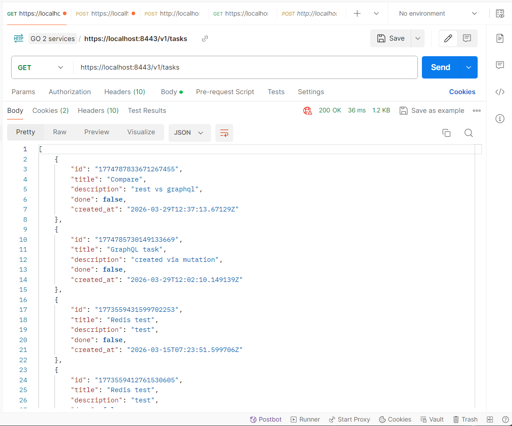
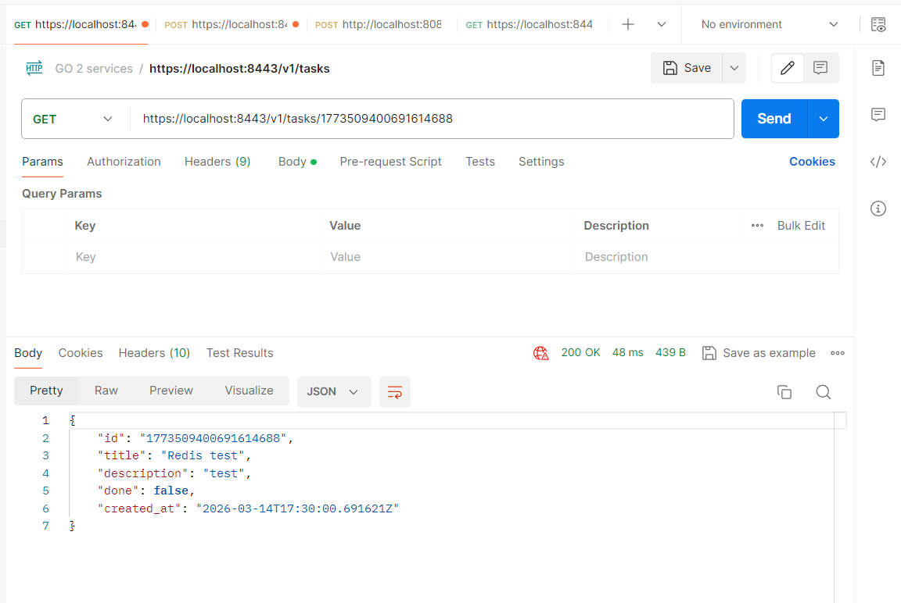
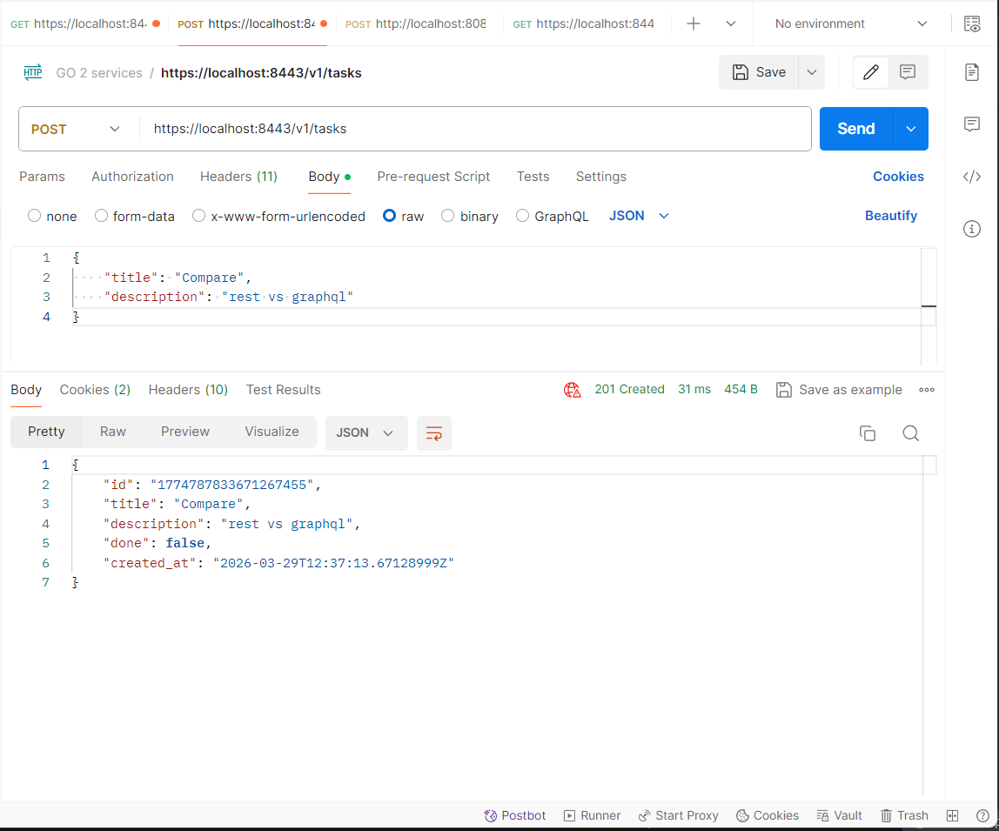
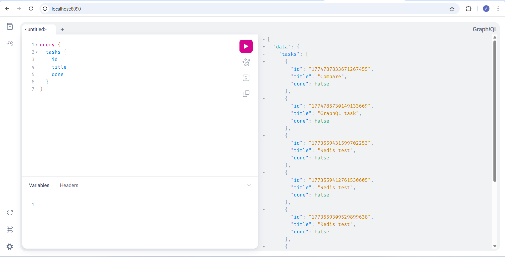
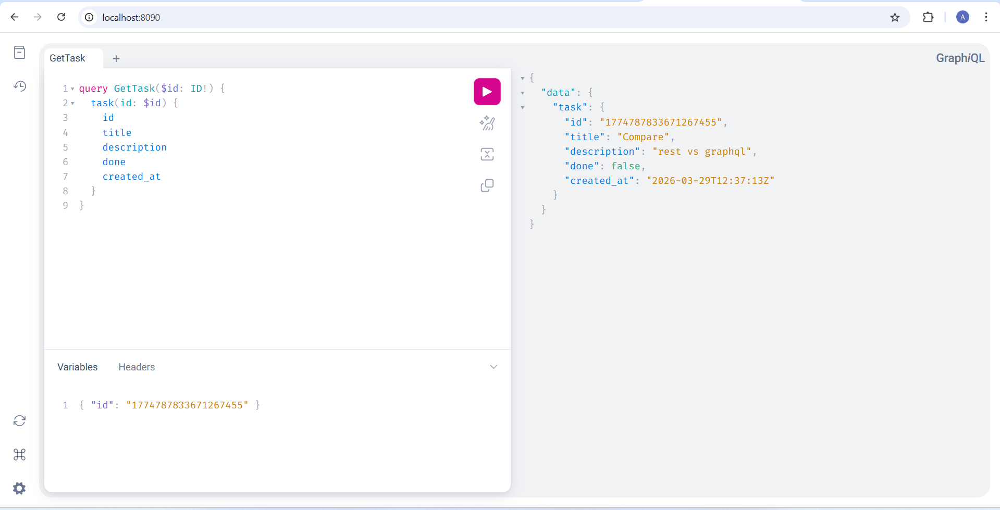
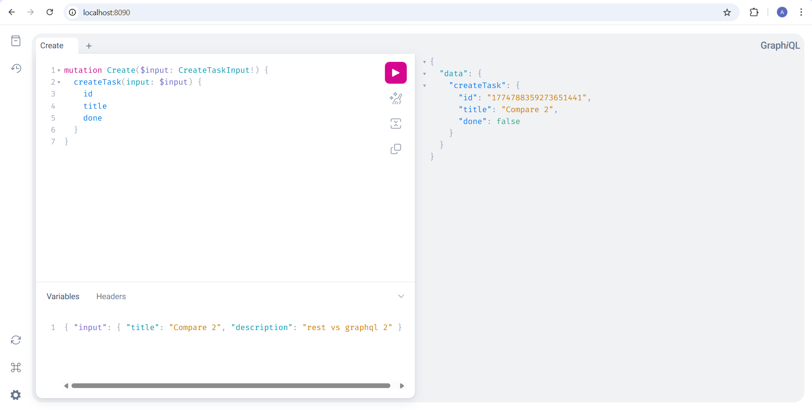

# Практическое занятие №12

## Сравнение REST и GraphQL: один функционал двумя способами

**Студент:** Холодков А.Д.  
**Группа:** ЭФМО-01-25

## Сценарий: «Экран задач»

Выбран типовой UI-сценарий — список задач с переходом на карточку детали и возможностью создать задачу.

| Экран | Нужные поля |
|-------|-------------|
| Список | `id`, `title`, `done` |
| Детали | `id`, `title`, `description`, `done`, `created_at` |
| Действие | Создать задачу: `title`, `description` |

## Запуск
```
cd deploy
docker compose up -d
```

## REST вариант

### Получить список задач

```powershell
$login = curl.exe -k -s -X POST https://localhost:8443/v1/auth/login `
  -H "Content-Type: application/json" -c cookies.txt `
  -d '{"username":"student","password":"student"}'
$CSRF = ($login | ConvertFrom-Json).csrf_token

curl.exe -k -s https://localhost:8443/v1/tasks -b cookies.txt
```

REST возвращает **все** поля независимо от того, что нужно клиенту:


Для экрана списка нужны только `id`, `title`, `done` — поля `description` и `created_at` получены **впустую** (over-fetching).

### Получить детали задачи

```powershell
curl.exe -k -s https://localhost:8443/v1/tasks/1773509400691614688 -b cookies.txt
```

те же все поля, теперь они все нужны.


### Создать задачу

```powershell
curl.exe -k -s -X POST https://localhost:8443/v1/tasks `
  -H "Content-Type: application/json" `
  -H "X-CSRF-Token: $CSRF" `
  -b cookies.txt `
  -d '{"title":"Compare","description":"rest vs graphql"}'
```



**Итого запросов для сценария: 3** (логин + список + детали + создание = 4, не считая логин — 3).

## GraphQL вариант

Сервис: `graphql` на `http://localhost:8090`

### Получить список (только нужные поля)

```graphql
query {
  tasks {
    id
    title
    done
  }
}
```

**только запрошенные поля**, без `description` и `created_at`:



### Получить детали задачи

```graphql
query GetTask($id: ID!) {
  task(id: $id) {
    id
    title
    description
    done
    created_at
  }
}
```

Variables:
```json
{ "id": "1774787833671267455" }
```



### Создать задачу

```graphql
mutation Create($input: CreateTaskInput!) {
  createTask(input: $input) {
    id
    title
    done
  }
}
```

Variables:
```json
{ "input": { "title": "Compare", "description": "rest vs graphql" } }
```



**Итого запросов для сценария: 3** (те же операции, но каждый запрос возвращает ровно нужные поля).

## Сравнение

### Количество запросов

| Операция | REST | GraphQL |
|----------|------|---------|
| Список задач | 1 запрос | 1 запрос |
| Детали задачи | 1 запрос | 1 запрос |
| Создать задачу | 1 запрос | 1 запрос |
| **Итого** | **3 запроса** | **3 запроса** |

По количеству запросов паритет. Преимущество GraphQL проявляется в сложных сценариях — например получить задачу вместе с её исполнителем и проектом можно **одним** запросом, тогда как REST потребует 3 отдельных запроса для аналогичного сценария.

### Объём данных

Для экрана **списка** (поля `id`, `title`, `done`):

| | REST | GraphQL |
|--|------|---------|
| Поля в ответе | 5 (все) | 3 (только нужные) |
| Лишние поля | `description`, `created_at` | нет |
| Проблема | Over-fetching | нет |

При 100 задачах с длинным `description` разница в объёме может быть существенной. GraphQL позволяет клиенту точно контролировать что получить в ответе.

### Обработка ошибок

| Критерий | REST | GraphQL |
|----------|------|---------|
| HTTP статус при ошибке | `404`, `400`, `500` | **всегда `200`** |
| Тело ошибки | `{"error": "task not found"}` | `{"errors": [{"message": "..."}]}` |
| Частичный успех | невозможен | возможен (часть данных + ошибки) |
| Мониторинг по статусам | удобно | сложнее — нужно анализировать тело |

Пример ошибки REST (задача не найдена):
```
HTTP 404
{"error": "task not found"}
```

Пример ошибки GraphQL (задача не найдена):
```
HTTP 200
{"data": {"task": null}, "errors": [{"message": "task not found"}]}
```

REST ошибки удобнее мониторить через HTTP статусы. GraphQL требует анализа тела ответа даже при ошибках.

### Кэширование

| Критерий | REST | GraphQL |
|----------|------|---------|
| Кэш по URL | легко (`GET /v1/tasks/123`) | один endpoint `/query` |
| HTTP кэш (CDN, браузер) | работает из коробки | требует доп. решений |
| Persisted queries | не нужны | нужны для нормального кэша |
| Кэш на уровне данных (Redis) | работает | работает одинаково |

В проекте Redis работает в обоих случаях одинаково — на уровне репозитория. Но HTTP-кэширование через CDN или браузер с GraphQL значительно сложнее.

## 5. Итоговый вывод

**REST предпочтительнее когда:**
- Публичное API (документирование, OpenAPI, Swagger).
- Нужно HTTP-кэширование (CDN, браузер).
- Простые CRUD операции с фиксированными ресурсами.

**GraphQL оправдан когда:**
- Мобильный клиент или медленный канал — важно минимизировать объём данных.
- Сложные вложенные данные (задача → исполнитель → проект) — один запрос вместо нескольких.
- Несколько клиентов (web, mobile, TV) с разными потребностями в полях.
- Быстро меняющийся фронтенд — не нужно менять бэкенд при добавлении полей.

Для данного проекта REST API с простыми задачами достаточен. GraphQL показал бы преимущество при добавлении связанных сущностей (пользователи, проекты, теги).