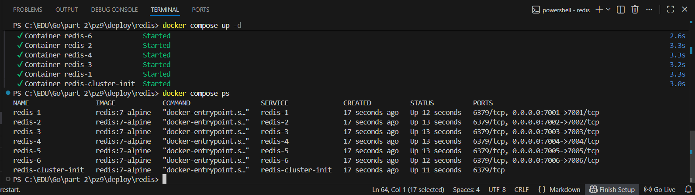
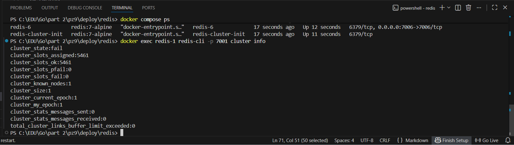
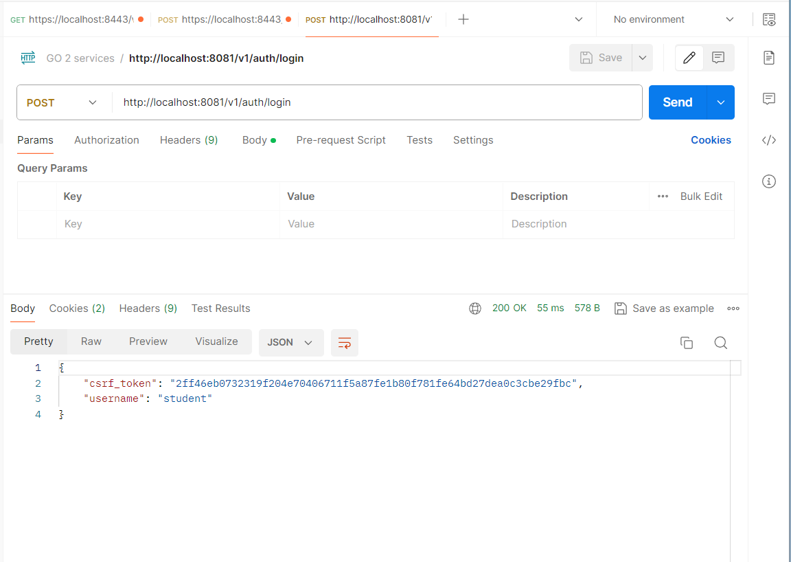
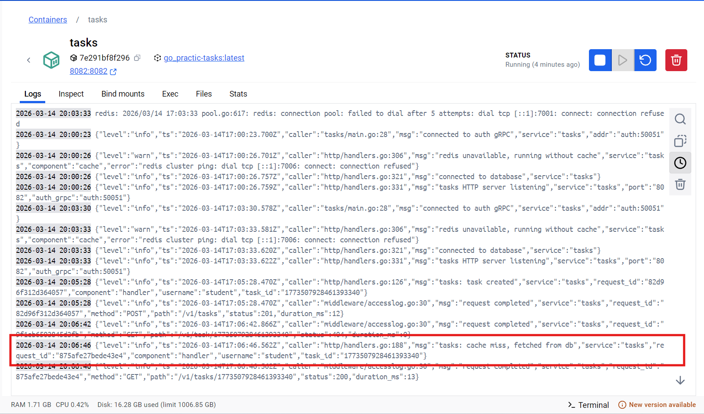
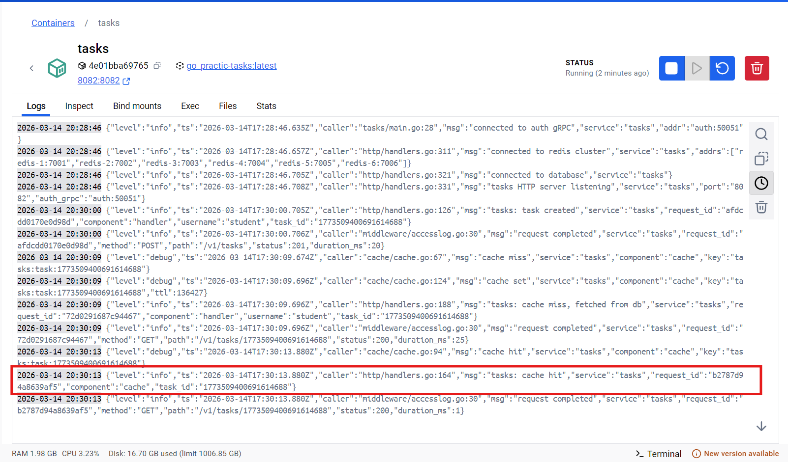
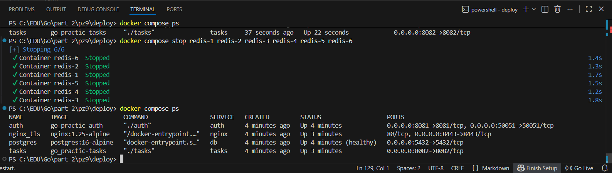
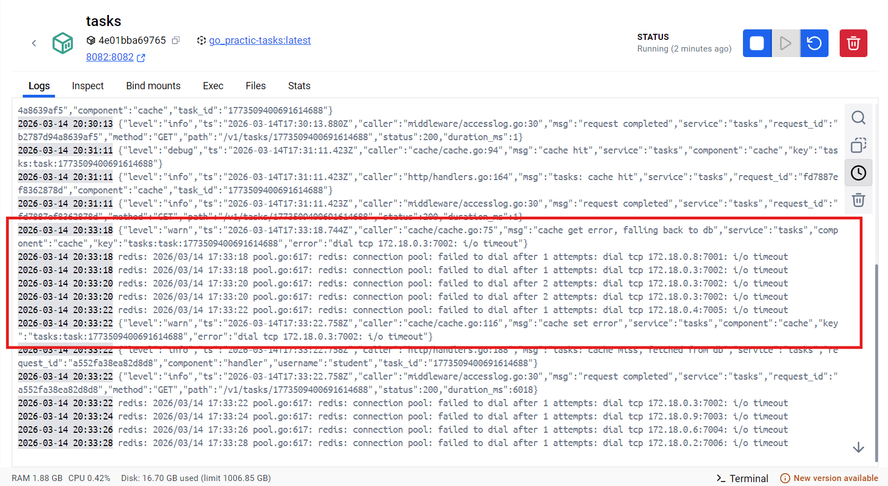
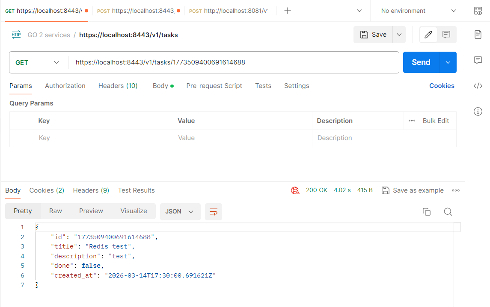

# Практическое занятие №9

## Реализация распределённого кэша (Redis Cluster)

**Студент:** Холодков А.Д.  
**Группа:** ЭФМО-01-25

## Ключи кэша и их формирование

| Ключ | Формат | Пример | Когда используется |
|------|--------|--------|--------------------|
| Одна задача | `tasks:task:<id>` | `tasks:task:1748291234` | GET /v1/tasks/{id} |
| Список задач | `tasks:list` | `tasks:list` | инвалидация при POST/PATCH/DELETE |

## Стратегия cache-aside

Алгоритм для `GET /v1/tasks/{id}`:

```
1. Сформировать ключ: tasks:task:<id>
2. redis.Get(key)
   ├── HIT  → десериализовать JSON → вернуть клиенту
   └── MISS → repo.Get(id) из PostgreSQL → redis.Set(key, json, TTL+jitter) → вернуть клиенту
```
Redis — **ускоритель**, источник истины — PostgreSQL. Данные в кэше всегда вторичны.

## TTL и Jitter

| Параметр | Значение по умолчанию | Переменная окружения |
|----------|-----------------------|---------------------|
| Базовый TTL | 120 секунд | `CACHE_TTL_SECONDS` |
| Максимальный jitter | 30 секунд | `CACHE_TTL_JITTER_SECONDS` |

Итоговый TTL каждого ключа = `120 + rand(0..30)` секунд.

**Зачем jitter:** если всем ключам поставить одинаковый TTL, они могут истечь одновременно и вызвать массовые запросы в БД (cache avalanche). Случайный разброс распределяет нагрузку во времени.

## Инвалидация кэша

| Операция | Что инвалидируется |
|----------|--------------------|
| `POST /v1/tasks` | `tasks:list` |
| `PATCH /v1/tasks/{id}` | `tasks:task:<id>` + `tasks:list` |
| `DELETE /v1/tasks/{id}` | `tasks:task:<id>` + `tasks:list` |

Принцип: **изменил — сбросил**. При следующем чтении данные подтянутся из БД и снова попадут в кэш.

## Деградация при недоступности Redis

При каждой операции с Redis:
- Ошибка `redis.Nil` (miss) — нормальная ситуация, идём в БД.
- Любая другая ошибка — логируем как `WARN`, идём в БД.
- Сервис никогда не возвращает ошибку клиенту из-за Redis.

## Запуск сервисов + Redis Cluster

```powershell
cd deploy
docker compose up -d
```

Проверить что все 6 нод запустились:
```powershell
docker compose ps
```



Проверить состояние кластера:
```powershell
docker exec redis-1 redis-cli -p 7001 cluster info
```



## Тестирование

### Получить токен и CSRF

```powershell
$login = curl.exe -k -s -X POST https://localhost:8081/v1/auth/login `
  -H "Content-Type: application/json" -c cookies.txt `
  -d '{"username":"student","password":"student"}'
$CSRF = ($login | ConvertFrom-Json).csrf_token
```


### Создать задачу

```powershell
$res = curl.exe -k -s -X POST https://localhost:8443/v1/tasks `
  -H "Content-Type: application/json" `
  -H "X-CSRF-Token: $CSRF" -b cookies.txt `
  -d '{"title":"Cache test","description":"Redis cache-aside"}'
$ID = ($res | ConvertFrom-Json).id
Write-Host "Task ID: $ID"
```


### Первый запрос — cache miss (данные из БД)

```powershell
curl.exe -k -i "https://localhost:8443/v1/tasks/$ID" -b cookies.txt
```

В логах tasks появилось:
```json
{"level":"info","msg":"tasks: cache miss, fetched from db","task_id":"..."}
```


### Второй запрос — cache hit (данные из Redis)

```powershell
curl.exe -k -i "https://localhost:8443/v1/tasks/$ID" -b cookies.txt
```

В логах tasks появилось:
```json
{"level":"info","msg":"tasks: cache hit","task_id":"..."}
```


### Симуляция недоступности Redis

```powershell
# Останавливаем кластер
docker compose stop redis-1 redis-2 redis-3 redis-4 redis-5 redis-6

# Делаем запрос — сервис должен ответить через БД
curl.exe -k -i "https://localhost:8443/v1/tasks/$ID" -b cookies.txt
```


В логах предупреждение, но ответ будет 200:
```json
{"level":"warn","msg":"cache get error, falling back to db","component":"cache"}
```


