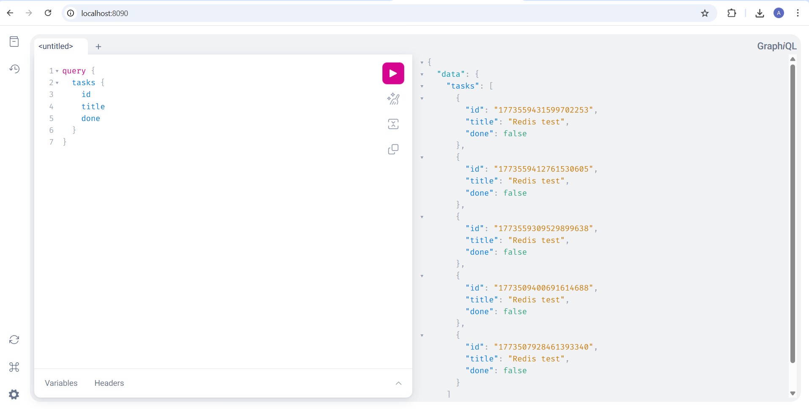
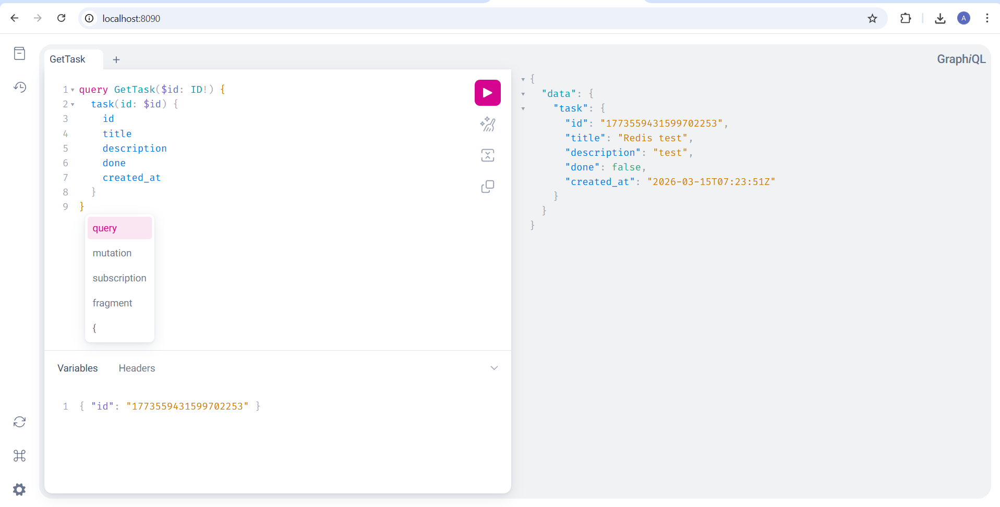
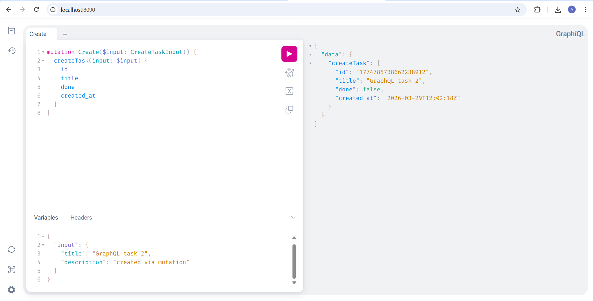
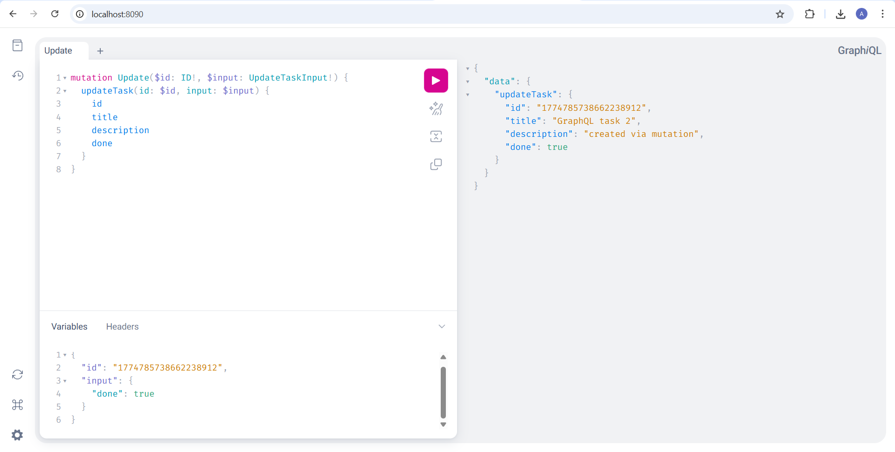
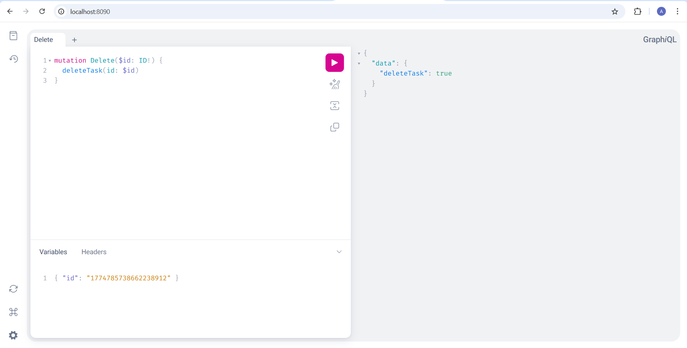

# Практическое занятие №11

## GraphQL API с использованием gqlgen. Запросы и мутации

**Студент:** Холодков А.Д.  
**Группа:** ЭФМО-01-25

## Схема GraphQL (`services/graphql/graph/schema.graphqls`)

```graphql
type Task {
  id:          ID!
  title:       String!
  description: String!
  done:        Boolean!
  created_at:  String!
}

input CreateTaskInput {
  title:       String!
  description: String
}

input UpdateTaskInput {
  title:       String
  description: String
  done:        Boolean
}

type Query {
  tasks:        [Task!]!
  task(id: ID!): Task
}

type Mutation {
  createTask(input: CreateTaskInput!): Task!
  updateTask(id: ID!, input: UpdateTaskInput!): Task!
  deleteTask(id: ID!): Boolean!
}
```

Схема — это **контракт**: клиент знает какие операции доступны и какие типы они возвращают. Резолверы — это реализация этого контракта на сервере.

## Структура сервиса

```
services/graphql/
├── Dockerfile
├── gqlgen.yml              ← конфиг кодогенератора
├── cmd/graphql/
│   └── main.go             ← точка входа, HTTP сервер
└── graph/
    ├── schema.graphqls     ← GraphQL схема (контракт)
    ├── resolver.go         ← реализация резолверов
    ├── model/
    │   └── models.go       ← Go-типы для GraphQL моделей
    └── generated/
        └── generated.go    ← автогенерируемый код gqlgen
```

Резолверы находятся в `graph/resolver.go` и используют тот же `repository.TaskRepository` что и REST tasks — единый источник данных.

## Генерация кода gqlgen

После изменения `schema.graphqls` нужно перегенерировать код:

```powershell
cd services/graphql
go run github.com/99designs/gqlgen generate
```

gqlgen создаёт `graph/generated/generated.go` с типами и интерфейсами.

## Генерация кода для graphql
```
go get -tool github.com/99designs/gqlgen
cd services/graphql
go tool gqlgen init
```
## Запуск приложения
```powershell
cd deploy
docker compose up -d --build
```

После запуска открыть **GraphQL Playground** в браузере:
```
http://localhost:8090/
```

### Получить список задач (Query)

```graphql
query {
  tasks {
    id
    title
    done
  }
}
```

_Скриншот — ответ query tasks в Playground:_



### Получить задачу по ID (Query)

```graphql
query GetTask($id: ID!) {
  task(id: $id) {
    id
    title
    description
    done
    created_at
  }
}
```

Variables:
```json
{ "id": "1748291234567890" }
```

_Скриншот — ответ query task(id):_



### Создать задачу (Mutation)

```graphql
mutation Create($input: CreateTaskInput!) {
  createTask(input: $input) {
    id
    title
    done
    created_at
  }
}
```

Variables:
```json
{
  "input": {
    "title": "GraphQL task",
    "description": "created via mutation"
  }
}
```

_Скриншот — ответ mutation createTask:_



### Обновить задачу (Mutation)

```graphql
mutation Update($id: ID!, $input: UpdateTaskInput!) {
  updateTask(id: $id, input: $input) {
    id
    title
    description
    done
  }
}
```

Variables:
```json
{
  "id": "1774785738662238912",
  "input": {
    "done": true
  }
}
```

_Скриншот — ответ mutation updateTask:_



### Удалить задачу (Mutation)

```graphql
mutation Delete($id: ID!) {
  deleteTask(id: $id)
}
```

Variables:
```json
{ "id": "1774785738662238912" }
```

_Скриншот — ответ mutation deleteTask (true/false):_



## Авторизация

В текущей учебной реализации авторизация для GraphQL упрощена:

- Query операции (`tasks`, `task`) доступны без авторизации — удобно для работы в Playground.
- Mutation операции в production следует защищать через заголовок `Authorization: Bearer <token>`, проверяя его через auth gRPC аналогично REST tasks.

При тестировании через curl заголовок передаётся так:

```powershell
curl.exe -s -X POST http://localhost:8090/query `
  -H "Content-Type: application/json" `
  -H "Authorization: Bearer <token>" `
  -d '{"query":"{ tasks { id title done } }"}'
```