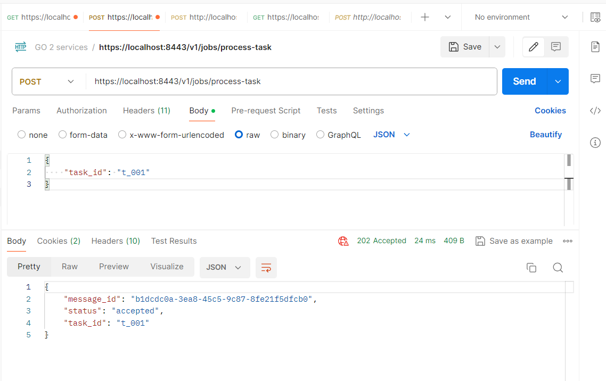
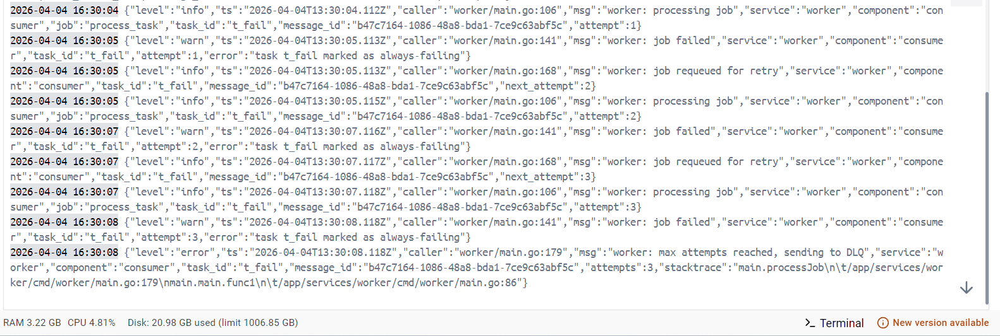
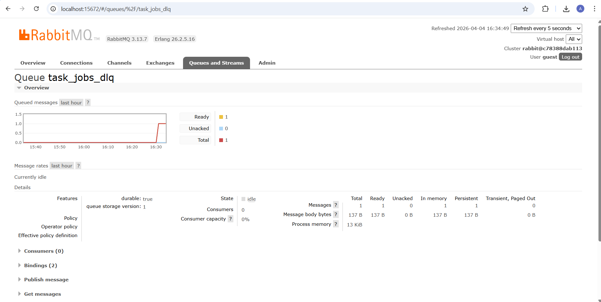

# Практическое занятие №14

## Очередь задач: retries, DLQ, идемпотентность

**Студент:** Холодков А.Д.  
**Группа:** ЭФМО-01-25

## 1. Очереди и маршрутизация

| Очередь / Exchange | Тип | Назначение |
|--------------------|-----|------------|
| `task_jobs` | queue (durable) | Основная очередь задач. Имеет `x-dead-letter-exchange: task_jobs_dlx` |
| `task_jobs_dlx` | exchange (fanout) | Dead-letter exchange — принимает отброшенные сообщения |
| `task_jobs_dlq` | queue (durable) | Dead-letter queue — хранит сообщения после исчерпания попыток |

## Формат сообщения

```json
{
  "job":        "process_task",
  "task_id":    "t_001",
  "attempt":    1,
  "message_id": "550e8400-e29b-41d4-a716-446655440000",
  "request_id": "pz14-001"
}
```

| Поле | Назначение |
|------|------------|
| `job` | Тип работы |
| `task_id` | ID задачи для обработки |
| `attempt` | Текущий номер попытки (начинается с 1) |
| `message_id` | UUID — ключ идемпотентности |
| `request_id` | Корреляция с HTTP запросом |

## Retry политика

- Максимум попыток: **3** (`MaxAttempts = 3`)
- При ошибке: worker увеличивает `attempt` и публикует сообщение заново в `task_jobs`, исходное `ack`
- При `attempt == MaxAttempts`: `nack(requeue=false)` → сообщение уходит в DLQ через DLX


Задержки между попытками: нет. Сообщение возвращается в конец очереди — при нескольких задачах это даёт небольшую паузу.

**Условие ошибки:**
- Детерминированная: `task_id` оканчивается на `fail` → всегда ошибка
- Случайная: 30% вероятность → для демонстрации retry

## Идемпотентность

**Ключ:** `message_id` (UUID, генерируется при постановке задачи в очередь)

**Хранилище:** `map[string]struct{}` в памяти worker'а (с mutex)

**Алгоритм:**
```go
if processed.has(job.MessageID) {
    // дубль — пропускаем, ack
    return
}
// выполняем работу...
processed.add(job.MessageID) // запоминаем
msg.Ack(false)
```

Защищает от сценария: worker выполнил работу, но упал до `ack` — RabbitMQ доставит сообщение повторно, но worker его пропустит.

## Запуск

```powershell
cd deploy
docker compose up -d --build
```

## Демонстрация

### Успешная обработка

```powershell
$login = curl.exe -k -s -X POST https://localhost:8443/v1/auth/login `
  -H "Content-Type: application/json" -c cookies.txt `
  -d '{"username":"student","password":"student"}'
$CSRF = ($login | ConvertFrom-Json).csrf_token

curl.exe -k -s -X POST https://localhost:8443/v1/jobs/process-task `
  -H "Content-Type: application/json" `
  -H "X-CSRF-Token: $CSRF" `
  -H "X-Request-ID: pz14-001" `
  -b cookies.txt `
  -d '{"task_id":"t_001"}'
```

Ответ (202 Accepted):
```json
{
    "message_id": "b47c7164-1086-48a8-bda1-7ce9c63abf5c",
    "status": "accepted",
    "task_id": "t_001"
}
```

Логи worker при успехе:
```json
2026-04-04 16:29:12 {"level":"info","ts":"2026-04-04T13:29:12.450Z","caller":"worker/main.go:106","msg":"worker: processing job","service":"worker","component":"consumer","job":"process_task","task_id":"t_001","message_id":"e52c9d03-84c3-487d-aacd-0bf76c822616","attempt":2}
2026-04-04 16:29:14 {"level":"info","ts":"2026-04-04T13:29:14.450Z","caller":"worker/main.go:130","msg":"worker: job completed","service":"worker","component":"consumer","task_id":"t_001","message_id":"e52c9d03-84c3-487d-aacd-0bf76c822616","attempt":2}
```

_Успешная обработка:_



### Retry и попадание в DLQ

```powershell
curl.exe -k -s -X POST https://localhost:8443/v1/jobs/process-task `
  -H "Content-Type: application/json" `
  -H "X-CSRF-Token: $CSRF" `
  -H "X-Request-ID: pz14-002" `
  -b cookies.txt `
  -d '{"task_id":"t_fail"}'
```

Логи worker (task_id оканчивается на `fail` — всегда ошибка):
```json
2026-04-04 16:30:08 {"level":"warn","ts":"2026-04-04T13:30:08.118Z","caller":"worker/main.go:141","msg":"worker: job failed","service":"worker","component":"consumer","task_id":"t_fail","attempt":3,"error":"task t_fail marked as always-failing"}

2026-04-04 16:30:08 {"level":"error","ts":"2026-04-04T13:30:08.118Z","caller":"worker/main.go:179","msg":"worker: max attempts reached, sending to DLQ","service":"worker","component":"consumer","task_id":"t_fail","message_id":"b47c7164-1086-48a8-bda1-7ce9c63abf5c","attempts":3,"stacktrace":"main.processJob\n\t/app/services/worker/cmd/worker/main.go:179\nmain.main.func1\n\t/app/services/worker/cmd/worker/main.go:86"}
```

_Retry и DLQ в логах worker:_



_Management UI: сообщение в task_jobs_dlq:_

