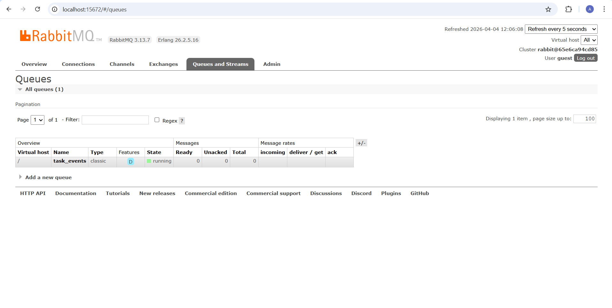
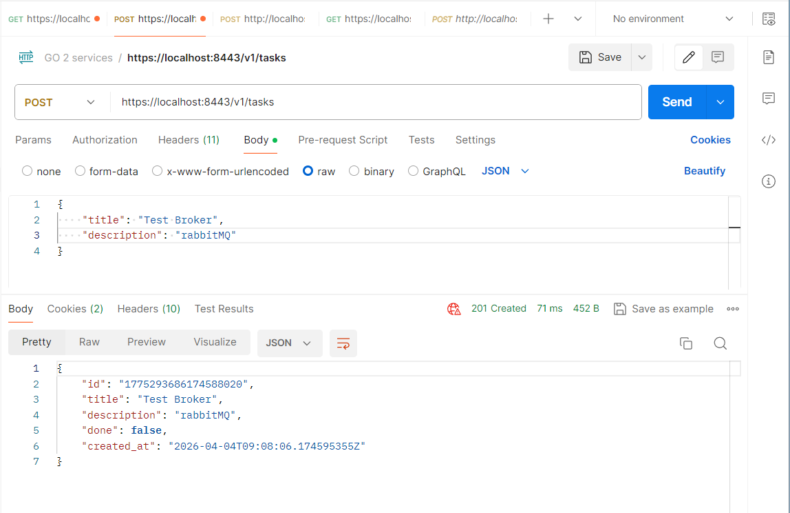
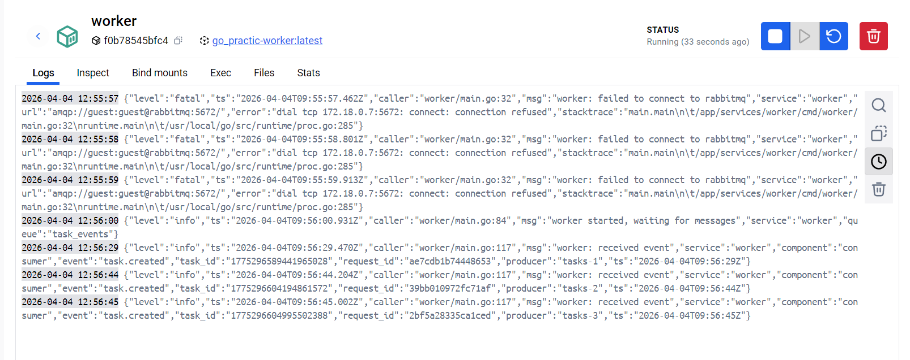
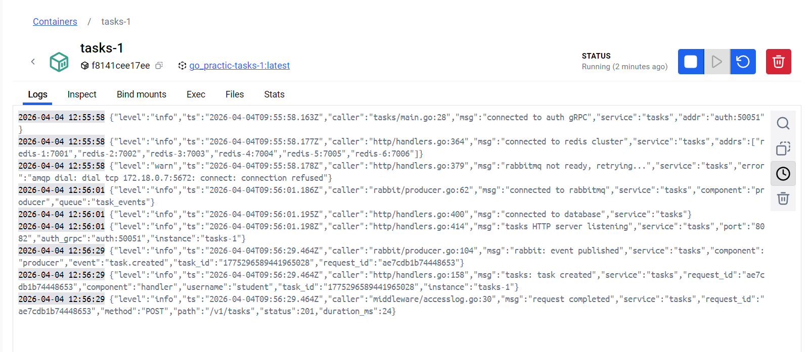

# Практическое занятие №13

## Подключение к RabbitMQ. Отправка и получение сообщений

**Студент:** Холодков А.Д.  
**Группа:** ЭФМО-01-25

## Архитектура

```
POST /v1/tasks
     │
     ▼
  tasks (producer)
     │ публикует TaskEvent в очередь task_events
     ▼
  RabbitMQ
     │ доставляет сообщение
     ▼
  worker (consumer)
     │ логирует событие + отправляет ack
     ▼
  сообщение удалено из очереди
```

## Формат сообщения

Сообщения публикуются в JSON. Поля:

| Поле | Тип | Описание |
|------|-----|----------|
| `event` | string | Тип события: `task.created`, `task.updated`, `task.deleted` |
| `task_id` | string | ID задачи |
| `ts` | string | Время события (RFC3339) |
| `request_id` | string | X-Request-ID для корреляции с логами |
| `producer` | string | Имя инстанса-источника (`tasks-1`, `tasks-2`, ...) |

Пример сообщения:
```json
{
  "event": "task.created",
  "task_id": "1748291234567890",
  "ts": "2026-03-15T10:00:00Z",
  "request_id": "pz13-001",
  "producer": "tasks-1"
}
```

## Параметры очереди

| Параметр | Значение | Зачем |
|----------|----------|-------|
| Имя | `task_events` | — |
| `durable` | `true` | очередь переживает рестарт брокера |
| `delivery_mode` | `2` (Persistent) | сообщение не потеряется при рестарте |
| `auto-ack` | `false` | подтверждаем вручную после обработки |
| `prefetch` | `1` | worker берёт одно сообщение за раз |

## Запуск

```powershell
cd deploy
docker compose up -d --build
```

RabbitMQ Management UI доступен на http://localhost:15672 (guest / guest).

_Скриншот — Management UI, очередь task_events:_



## Проверка

### Получить токен

```powershell
$login = curl.exe -k -s -X POST https://localhost:8443/v1/auth/login `
  -H "Content-Type: application/json" -c cookies.txt `
  -d '{"username":"student","password":"student"}'
$CSRF = ($login | ConvertFrom-Json).csrf_token
```

### Создать задачу

```powershell
curl.exe -k -s -X POST https://localhost:8443/v1/tasks `
  -H "Content-Type: application/json" `
  -H "X-CSRF-Token: $CSRF" `
  -H "X-Request-ID: pz13-001" `
  -b cookies.txt `
  -d '{"title":"Rabbit","description":"publish event"}'
```



### Логи worker

```powershell
docker logs worker
```

_Скриншот — логи tasks (событие опубликовано) и worker (событие получено):_




## Повторная доставка

Если worker упадёт **до отправки ack**, RabbitMQ вернёт сообщение в очередь и доставит снова при следующем подключении. Это гарантирует, что сообщение будет обработано хотя бы один раз.

Обработчик иденпотентен — повторная обработка того же события не должна давать побочных эффектов. (в данной работе только логируем, не изменяя)